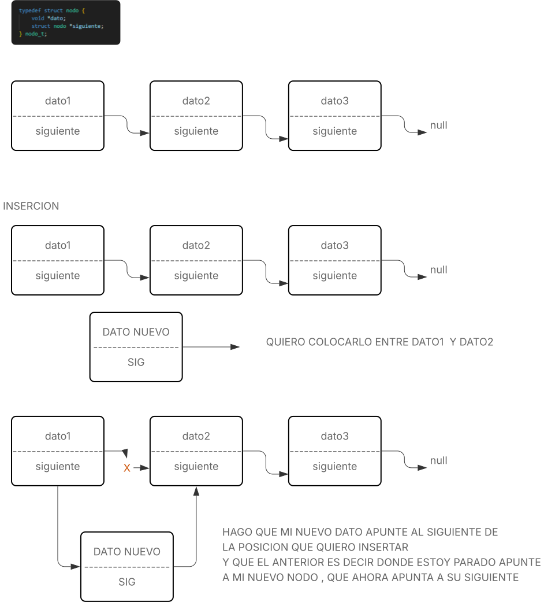

<div align="right">

</div>

# TDA LISTA/PILA/COLA

## Repositorio de JERONIMO PEREZ CORDOBA - (111939) - JEROPEREZ42@GMAIL.COM - JEPEREZC@FI.UBA.AR

El proyecto incluye un archivo Makefile. Para compilar, simplemente ejecuta make en la terminal

```bash
make
```

- Para ejecutar las pruebas:
```bash
make run
```

- Para ejecutar las pruebas con valgrind:
```bash
make valgrind
```


- Para ejecutar el programa principal con un ID diferente o Nombre 
```
./main ../TP1-ENUNCIADO/pokedex.csv --id (CUALQUIER ID)
./main ../TP1-ENUNCIADO/pokedex.csv --nombre (NOMBRE)
```


---
##  Funcionamiento

## LISTA ##

- LISTA_CREAR()
    Reserva memoria para la estructura principal de la lista usando `calloc`, lo que inicializa todos los campos en cero. Inicializa los punteros y el contador en cero. Complejidad: O(1) porque solo se realiza una asignación de memoria y no depende del tamaño de la lista.

- LISTA_VACIA()
    Chequeamos que la lista sea valida, con cantidad mayor a cero , en caso de que no se cumpla se devuelve false . Complejidad: O(1), porque solo se consulta un campo de la estructura sin recorrer la lista.

- LISTA_CANTIDAD()
    Devuelve el número de elementos almacenados, accediendo directamente al campo cantidad. Complejidad: O(1).

- LISTA_AGREGAR()
    Agrega un elemento al final de la lista. Usa el puntero ultimo para hacerlo en tiempo constante. Si la lista está vacía, actualiza ambos punteros (primero y ultimo). Complejidad:  al usar el puntero al ultimo nodo , su accion es en O(1)

- LISTA_INSERTAR()
    Inserta un elemento en una posición específica. Si es al principio, delega en una función auxiliar. Para otras posiciones, recorre la lista hasta la posición deseada. Complejidad: O(n) porque para insertar en una posición arbitraria (no al principio), hay que recorrer la lista hasta esa posición.
    
<div align="center">

</div>

- LISTA_ELIMINAR_ELEMENTO 
    Elimina el elemento en la posición indicada. Si es el primero, lo elimina en tiempo constante. Para otras posiciones, recorre la lista hasta el nodo anterior. Complejidad: O(n) porque para eliminar en una posición arbitraria (no al principio), hay que recorrer la lista hasta el nodo anterior.

- LISTA_BUSCAR_POSICION()
    Busca la posición de un elemento usando una función de comparación. Recorre la lista hasta encontrar el elemento. Complejidad: O(n) porque busca un elemento recorriendo la lista y comparando uno por uno.

- LISTA_BUSCAR_ELEMENTO()
    Devuelve el elemento en la posición indicada, recorriendo la lista hasta llegar a esa posición.  Complejidad: O(n) porque accede a una posición arbitraria recorriendo la lista desde el principio.

- LISTA_CON_CADA_ELEMENTO()
    Recorre la lista y aplica una función a cada elemento, permitiendo cortar el recorrido si la función lo indica. Complejidad: O(n) porque recorre todos los elementos de la lista aplicando una función.

- LISTA_DESTRUIR Y LISTA_DESTRUIR_TODO
    Libera la memoria de todos los nodos. lista_destruir_todo además aplica una función destructora a cada dato almacenado. Complejidad: O(n) porque libera la memoria de todos los nodos recorriendo la lista.

Iterador externo (lista_iterador_crear, lista_iterador_hay_mas_elementos, lista_iterador_siguiente, lista_iterador_obtener_actual, lista_iterador_destruir)
Permite recorrer la lista desde afuera, manteniendo el estado actual. Complejidad: O(1) por operación, porque solo accede o avanza el puntero actual, sin recorrer la lista completa.

<div align="center">

</div>
---
## COLA ##

- COLA_CREAR()
    Reserva memoria para la estructura principal de la cola usando 'calloc', inicializando los punteros y el contador en cero.  
    Complejidad :O(1), porque solo se realiza una asignación de memoria.
    
<div align="center">

</div>

- COLA_ENCOLAR()
    Agrega un elemento al final de la cola usando el puntero al último nodo.  
    Complejidad: O(1), porque no es necesario recorrer la estructura.

- COLA_DESENCOLAR()
    Elimina el primer elemento de la cola y actualiza el puntero al nuevo primero.  
    Complejidad: O(1), porque solo se modifica el puntero y se libera un nodo.

- COLA_PRIMERO()
    Devuelve el elemento al frente de la cola sin eliminarlo.  
    Complejidad: O(1), porque accede directamente al puntero del primer nodo.

- COLA_VACIA()
    Verifica si la cola está vacía consultando el campo cantidad.  
    Complejidad: O(1), porque solo accede a un campo de la estructura.

- COLA_DESTRUIR()
    Libera la memoria de todos los nodos de la cola.  
    Complejidad: O(n), porque recorre y libera cada nodo.

---

## PILA ##

- PILA_CREAR()
    Reserva memoria para la estructura principal de la pila usando 'calloc', inicializando el puntero y el contador en cero.  
    Complejidad:O(1), porque solo se realiza una asignación de memoria.

- PILA_APILAR()
    Agrega un elemento en el tope de la pila, actualizando el puntero al nuevo nodo.  
    Complejidad: O(1), porque no es necesario recorrer la estructura.

- PILA_DESAPILAR()
    Elimina el elemento en el tope de la pila y actualiza el puntero al nuevo tope.  
    Complejidad: O(1), porque solo se modifica el puntero y se libera un nodo.

- PILA_TOPE()
    Devuelve el elemento en el tope de la pila sin eliminarlo.  
    Complejidad: O(1), porque accede directamente al puntero del tope.

- PILA_VACIA()
    Verifica si la pila está vacía consultando el campo cantidad.  
    Complejidad: O(1), porque solo accede a un campo de la estructura.

- PILA_DESTRUIR()
    Libera la memoria de todos los nodos de la pila.  
    Complejidad: O(n), porque recorre y libera cada nodo.


---

## Respuestas a las preguntas teóricas

- Explicar qué es una lista, lista enlazada y lista doblemente enlazada
    Una lista ENLAZADA se la puede describir como una suma de nodos, con datos y un puntero al siguiente nodo , formando asi un grupo de nodos conectados a traves de un puntero,
    se puede visitar al siguiente y crear primitivas para manipular la lista, siempre y cuando se cumpla que solo se puede avanzar en una dirección (hacia adelante). 

    La lista DOBLEMENTE ENLAZADA es lo mismo que la lista simplemente enlazada , pero con la difencia de un puntero a su nodo anterior , esto permite recorrer la lista en ambas direcciones (hacia adelante y hacia atrás) y facilita operaciones como inserción y eliminación en cualquier posición.

- *VENTAJAS:*
    **Lista simplemente enlazada:**
    - Menor uso de memoria (un solo puntero por nodo).
    - Implementación más sencilla.

- *DESVENTAJAS:*  
    - No se puede retroceder fácilmente.
    - Eliminar un nodo requiere conocer el anterior, lo que puede requerir    recorrer la lista.

- *VENTAJAS:*
    **Lista doblemente enlazada:**
    - Permite recorrer en ambos sentidos.
    - Eliminar o insertar nodos en cualquier posición es más eficiente, ya que se puede acceder al anterior directamente.

- *DESVENTAJAS:*  
    - Mayor uso de memoria (dos punteros por nodo).
    - Implementación más compleja (más casos a manejar en inserción/eliminación).

---

- Explicar qué es una lista circular y de qué maneras se puede implementar.
    Una lista circular es una variante de una lista enlazada, en la que su ultimo nodo , en vez de apuntar a null , apunta a primer elemento de la lista, (como una sepiente comiendose su cola).Esto permite recorrer la lista de manera continua, sin llegar nunca a un final.

    **Formas de implementación:**
    - *Lista simplemente enlazada circular:*  
      Cada nodo tiene un puntero al siguiente, y el último nodo apunta al primero. Se puede recorrer la lista indefinidamente en una sola dirección.

    - *Lista doblemente enlazada circular:*  
      Cada nodo tiene punteros al siguiente y al anterior. El ultimo nodo apunta al primero y el primero apunta al ultimo, permitiendo recorrer la lista en ambos sentidos de forma circular.

---

 - Explicar la diferencia de funcionamiento entre cola y pila.
    La gran difencia entre la pila y cola es como se agregan o retiran elementos.

    - **Cola:**  
    Cumple con la regla FIFO (First In, First Out),  El primer elemento en entrar es el primero en salir. Ejemplo: encolar (agregar) elementos al final y desencolar (retirar) elementos del principio, osea el primero que se encolo.

    - **Pila:**  
    Cumple la regla LIFO (last In , First Out) El último elemento en entrar es el primero en salir. Ejemplo: apilar (agregar) elementos en el tope y desapilar (retirar) elementos del tope.
    En resumen, la cola procesa los elementos en el orden en que llegan, mientras que la pila procesa primero el elemento más reciente.

---
- Explicar la diferencia entre un iterador interno y uno externo.

    Un **iterador interno** es una función que recorre la estructura de datos aplicando una acción (función callback) a cada elemento. El usuario no controla el recorrido, solo define la acción a realizar. Ejemplo: `lista_con_cada_elemento()`.

    Un **iterador externo** es un objeto que permite al usuario recorrer la estructura paso a paso, controlando cuándo avanzar y acceder al elemento actual. El usuario decide el ritmo y puede interrumpir el recorrido en cualquier momento. Ejemplo: `lista_iterador_crear()`, `lista_iterador_siguiente()`.

    Se puede decir que el iterador interno hace el recorrido automaticamente, a diferencia del externo que le da el control al usuario.
    